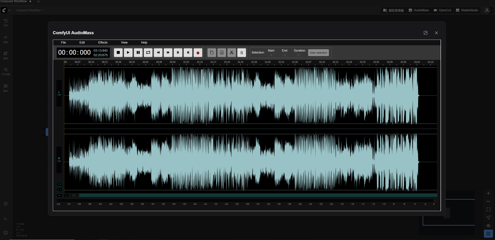

# ComfyUI-AudioMass

<div align="center">

English | [简体中文](./README_CN.md)

</div>

A ComfyUI plugin that seamlessly integrates the powerful [AudioMass](https://github.com/pkalogiros/audiomass) audio editor into your ComfyUI workflow.



## Features

- **🎵 Full-Featured Audio Editor** - Complete audio editing capabilities directly within ComfyUI
- **✂️ Audio Processing** - Cut, copy, paste, and manipulate audio with ease
- **🎛️ Effects & Filters** - Apply various audio effects including:
  - Equalizer
  - Noise reduction (RNN-based)
  - Auto-tune
  - Various audio filters
- **💾 Multiple Format Support** - Export to MP3, WAV, and FLAC formats
- **🌍 Internationalization** - Multi-language support
- **📊 Waveform Visualization** - Visual audio waveform display for precise editing
- **🎙️ Recording Support** - Record audio directly in the interface
- **🔧 ComfyUI Integration** - Seamless integration with ComfyUI nodes

## Installation

1. Clone this repository into your ComfyUI `custom_nodes` directory:
   ```bash
   cd ComfyUI/custom_nodes
   git clone https://github.com/jtydhr88/ComfyUI-AudioMass
   ```

2. Restart ComfyUI

## Usage

### Method 1: Direct Browser Access
Navigate to `http://127.0.0.1:8188/audiomass/` in your browser to access the AudioMass interface directly.

### Method 2: ComfyUI Integration
*(Requires ComfyUI version after 2024-08-08 with frontend version 1.24.4 or higher)*

Click the "AudioMass" button in the ComfyUI interface to open the audio editor in a dialog window.

## Technical Details

- **Backend**: Python-based server integration with ComfyUI
- **Frontend**: Vue.js application with PrimeVue components
- **Audio Processing**: WebAssembly-based audio codecs (LAME for MP3, libFLAC for FLAC)
- **Noise Reduction**: RNN (Recurrent Neural Network) based denoising

## Requirements

- ComfyUI (latest version recommended)
- Modern web browser with WebAssembly support

## License

This project integrates AudioMass, which is licensed under GPL-3.0. Please refer to the original [AudioMass repository](https://github.com/pkalogiros/audiomass) for license details.

## Credits

- Original AudioMass developed by [pkalogiros](https://github.com/pkalogiros)
- ComfyUI integration by [jtydhr88](https://github.com/jtydhr88)

## Support

For issues, questions, or contributions, please visit the [GitHub repository](https://github.com/jtydhr88/ComfyUI-AudioMass).